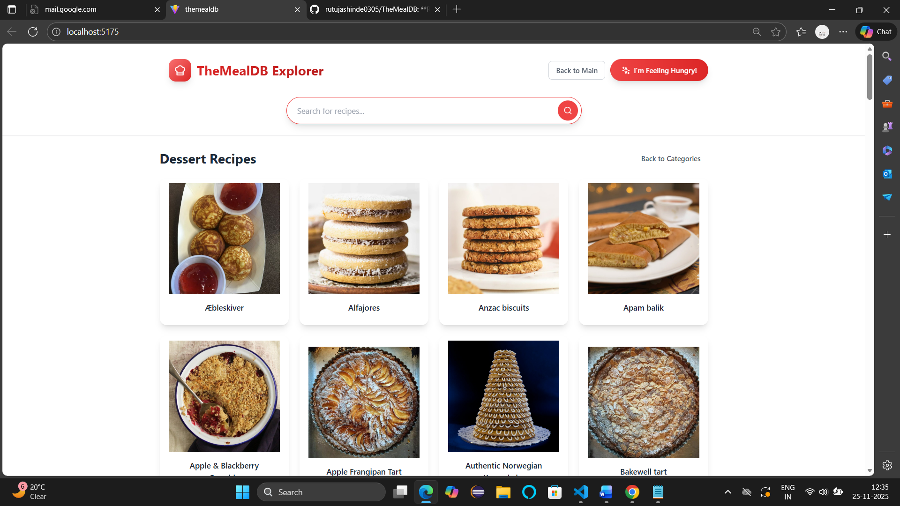
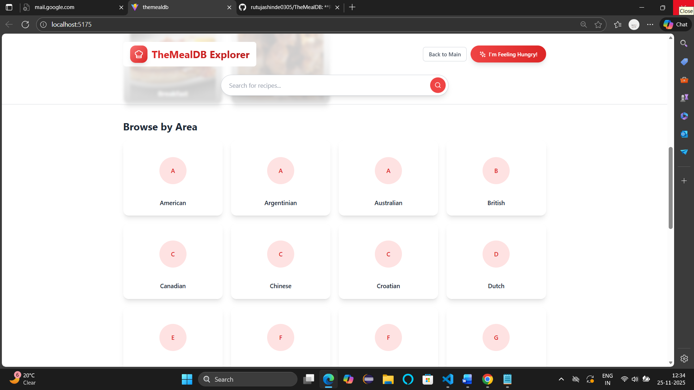
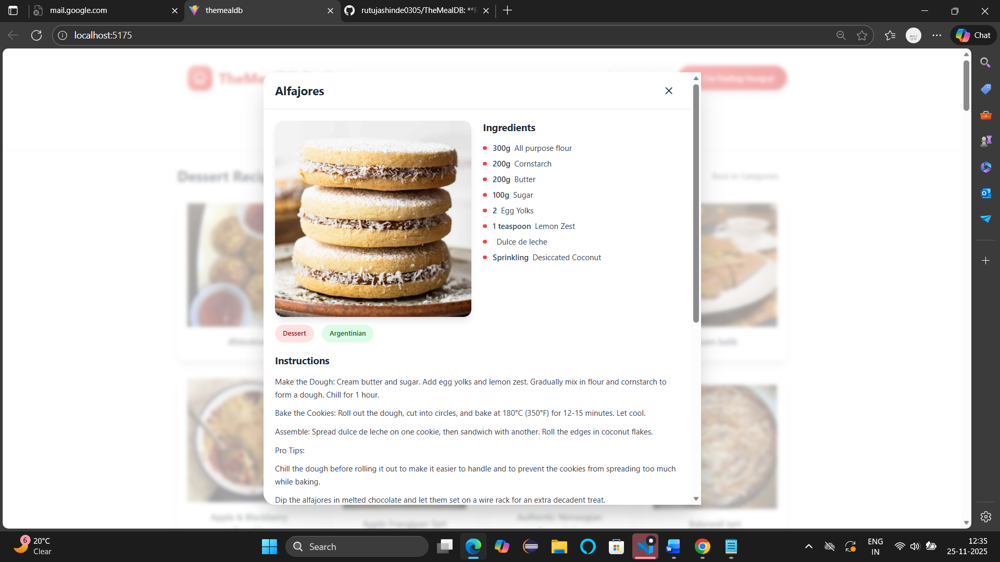
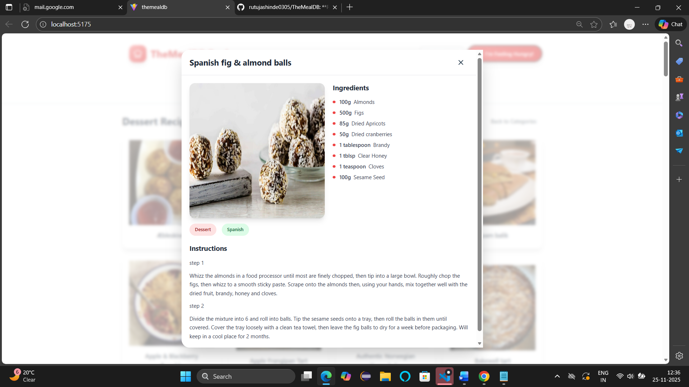
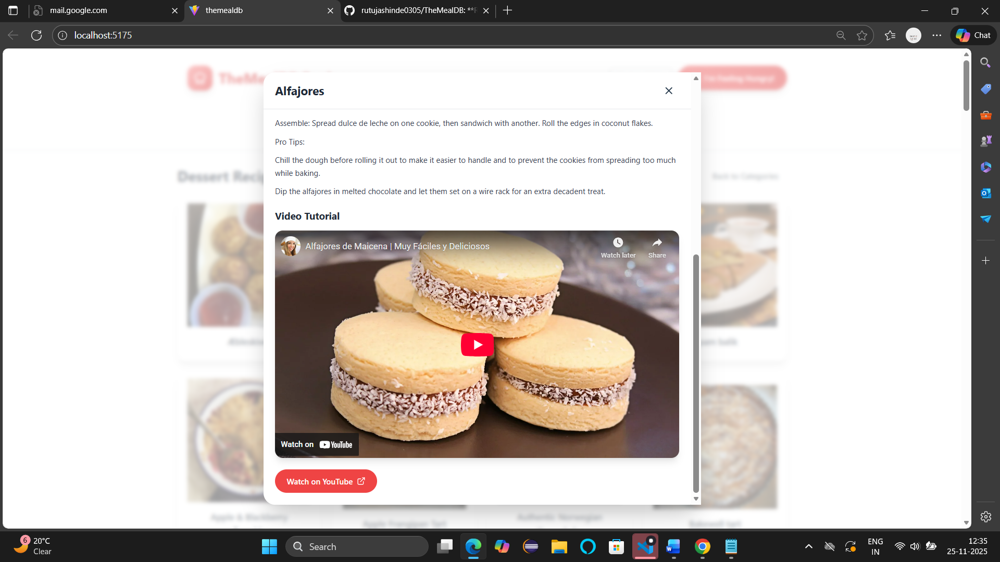

# TheMealDB Explorer

A full-stack recipe discovery application featuring React + Vite frontend and Node.js Express backend with intelligent caching.

**GitHub Repository:** https://github.com/rutujashinde0305/TheMealDB

## Features

- 🔍 **Recipe Search** - Search meals by name in real-time
- 📂 **Category Browser** - Explore 14+ meal categories (Chicken, Vegan, etc.)
- 🌍 **Cuisine/Area Filter** - Browse recipes from 25+ cuisines worldwide
- 🎲 **Random Meal** - "I'm Feeling Hungry" button for discovering recipes
- 📖 **Recipe Details** - View ingredients, instructions, and YouTube videos
- 📱 **Responsive Design** - Optimized for mobile, tablet, and desktop
- 🔐 **User Auth UI** - Professional login/register with success messages
- ⚡ **Smart Caching** - LRU cache + optional Redis for lightning-fast results

## Quick Start

### Installation

```bash
git clone https://github.com/rutujashinde0305/TheMealDB.git
cd TheMealDB
npm install
```

### Running Locally

**Terminal 1: Start API**
```bash
node server/api.js
```

**Terminal 2: Start Frontend**
```bash
npm run dev
```

**Or both together:**
```bash
npm run dev:all
```

Visit http://localhost:5175

## API Endpoints

```
GET  /api/categories          - List all meal categories
GET  /api/areas              - List all cuisines
GET  /api/search?s=<name>    - Search meals
GET  /api/filter?c=<cat>     - Filter by category
GET  /api/filterByArea?a=<area> - Filter by area
GET  /api/random             - Get random meal
GET  /api/lookup?i=<id>      - Get meal by ID
GET  /api/health             - Health check
```

## Caching

- **In-Memory LRU Cache**: 1000 entries, 5 min TTL
- **Optional Redis**: Set `REDIS_URL` environment variable
- **Performance**: ~80% API call reduction

## Code Quality

```bash
npm run lint    # ESLint: 0 errors
npm run build   # Production build: ✓
```

## Tech Stack

**Frontend:** React 18 + Vite 5 + Tailwind CSS  
**Backend:** Node.js + Express + LRU Cache  
**Data Source:** TheMealDB Public API

## Requirements Met

✅ Web service API (REST)  
✅ Frontend layer (React + Vite)  
✅ Caching (LRU + Redis optional)  
✅ Local execution  
✅ Responsive design  
✅ Code quality  
✅ Public GitHub repo  

See **SUBMISSION.md** for complete requirement verification.

---

## Screenshots

Below are a couple of screenshots showing the app UI. Replace the placeholder images in `public/screenshots/` with real screenshots if you have them.

- Hero / Landing view
Below are screenshots showing the app UI. These use the images in `public/screenshots/`.

- Hero / Landing view


- Browse / Categories view


- Category detail view



- Search results


- Search by area



- Recipe detail



- Random / I'm Feeling Hungry



- Video / YouTube embed



**Status:** Ready for Submission ✅
